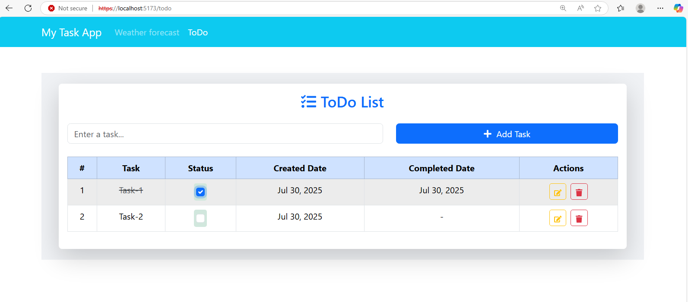

## 🌤️ My Task App
A simple and responsive React application to display a weather forecast and manage a to-do list, using modern frontend tools and libraries.

🔧 Technologies Used
React (with Hooks)

React Router DOM v6

React Bootstrap + Bootstrap

Vite (or Create React App based on your setup)

## 📂 Project Structure

ToDoSPA/
├── public/
├── src/
│   ├── App.jsx
│   ├── Home.jsx
│   ├── Component/
│   │   └── Todo.jsx
│   ├── index.css
│   └── main.jsx / index.js
├── package.json
└── README.md
## 🚀 Features
✅ Clean, responsive navigation bar

✅ Page routing using React Router DOM

✅ Weather forecast (placeholder) on home page

✅ ToDo list management page

✅ Bootstrap-based styling for professional look

## 🧩 Getting Started
📁 Clone the Repository
git clone https://github.com/hasanuxaman/TodoSPA.git

## 📦 Install Dependencies

npm install
## ▶️ Run the App
For Vite:

npm run dev
For Create React App:

npm start
## 🌐 Open in Browser
Vite: http://localhost:5173

CRA: http://localhost:3000

## 🔄 Routing Overview
### Path	Component	Description
/	Home.jsx	Shows weather forecast
-
/todo	Todo.jsx	Task list manager
-
## 🖼️ Screenshot

## 🚀 Deployment Options
IIS Server

## 👤 Author
Md Hasanuzzaman Rony
📧 Email: hasanuxaman.rony@gmail.com

## 📄 License
This project is licensed under the MIT License.
